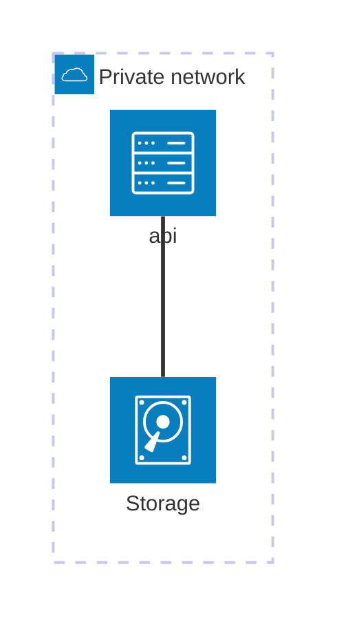

# phantom

Stream video from usb device over the web.
It is about turning an old Raspberry Pi, with a video device (USB, PCI, etc.), into a home camera.



Once installed, you should be able to connect to your server through your VPN and stream from your video device.

## prerequisite

- gocv
- opencv4 (gocv dependency)

In order to install opencv4 you can either rely on your system package manager or compile it directly using:

```bash
cd $GOPATH/gocv.io/x/gocv
make install
```

## Getting started

Build the container

```bash
podman build -t phantom:$(git describe) .
```

Run the container

```bash
podman run --device /dev/video0 -p 8080:8080 localhost/phantom:$(git describe) /app/main
```
